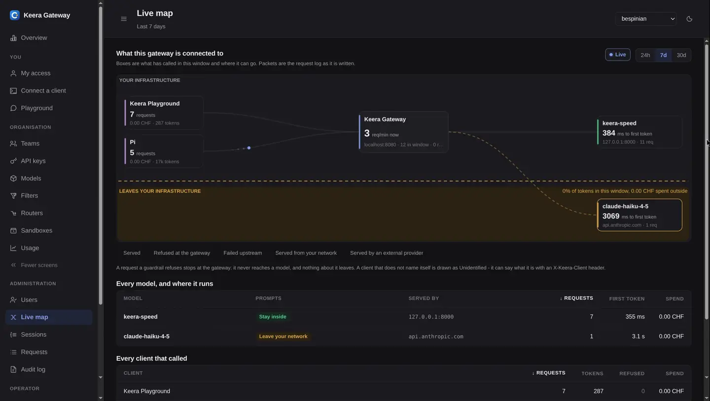

# Keera Gateway - one endpoint for every AI request

[keera.ch](https://keera.ch)

One static Go binary in front of every model you run yourself and every one you
license. You decide who may use which model, and how. It runs in your own
infrastructure or in a Swiss data centre, and nothing leaves that you did not
allow.

The gateway is one half of Keera, the AI stack run in Switzerland. The other
half is **Keera Engine**: open-weight coding models served on vLLM, on your own
GPUs or on Swiss ones.



## What is in this repository

- **Keera Gateway** - the server binary, `cmd/keera-gateway`: guardrails,
  budgets, filters, routers, sandboxes, the control panel and the audit log.
- **Keera CLI** - the `keera` command, `cmd/keera`. It administers a deployment
  and sets up a developer's editor for it. Every
  [release](https://github.com/bespinian/keera-gateway/releases) has it for
  Linux, macOS and Windows.
- **A single-host deployment** - compose files that run the gateway, its
  database and Keera Engine on one machine. This is also the development loop.

Every tool that calls a model uses the same address. The gateway checks each
request, logs it and passes it on.

```
        Your tools                       Keera Gateway                          Models
┌───────────────────────┐         ┌──────────────────────────┐         ┌─────────────────────┐
│ Claude Code           │         │ 1  Identify the key, its │         │ Keera Engine on     │
│ OpenCode, Pi          │         │    team and its org      │         │ vLLM, on your GPUs  │
│ Internal apps         │  HTTPS  │ 2  Apply guardrails,     │         │ or Swiss ones       │
│ Notebooks and CI jobs │────────▶│    budget, rate limit    │────────▶│                     │
│ any OpenAI client     │         │ 3  Filter secrets and    │         │ Anthropic and other │
└───────────────────────┘         │    personal data out     │         │ providers, opened   │
                                  │ 4  Route to a model the  │         │ by policy           │
                                  │    key may use           │         └─────────────────────┘
                                  └─────────────┬────────────┘
                                                │
                                                ▼
                               Every request into the audit log,
                                    Postgres and your SIEM
```

Everything runs on one port, `:8080`, split by path:

- `/api` - inference and MCP servers
- `/` - the control panel
- `/control` - administration
- `/sandbox` - attaching to a sandbox

Authentication, not the network, keeps the inference side and the control side
apart. To split them on the network as well, put a proxy in front that
publishes only `/api`.

The gateway speaks three APIs, all with the same guardrails, accounting and
audit:

- the OpenAI API: `/api/v1/chat/completions`, `/api/v1/completions` and
  `/api/v1/embeddings`
- the Anthropic Messages API, used by Claude Code: `/api/v1/messages`
- the OpenAI Responses API, used by Codex: `/api/v1/responses`

A Messages request to Anthropic, or a Responses request to OpenAI, is forwarded
in its own API, so prompt caching and reasoning keep working. To switch
provider, a client changes one variable.

## Run it

```sh
cd compose
cp .env.example .env    # then set KEERA_OPERATOR_KEY and KEERA_SECRET_KEY

# A laptop or any host without a GPU (llama.cpp; no tool calls):
podman compose -f compose.yaml -f compose.cpu.yaml up -d --build

# A GPU host (vLLM):
podman compose -f compose.yaml -f compose.gpu.yaml up -d --build
```

On the first start the inference container downloads model weights and stays
unready for several minutes. Do not restart it. The CPU tier cannot do tool
calls, so it cannot demo a coding agent. See
[compose/README.md](compose/README.md).

Then issue a key and use it:

```sh
export KEERA_OPERATOR_KEY=…              # the same value as in .env
keera org create "Example Bank"
keera team create "Payments Platform"
KEY=$(keera key create --team <team-id> --alias "a developer's laptop")

curl http://127.0.0.1:8080/api/v1/chat/completions \
  -H "Authorization: Bearer $KEY" -H 'Content-Type: application/json' \
  -d '{"model":"keera-speed","messages":[{"role":"user","content":"What is Kubernetes?"}]}'
```

Or open the control panel at <http://127.0.0.1:8080> and sign in with the
operator key. **Overview** shows a first-run checklist.
[docs/install.md](docs/install.md) covers every setting, the first run and
troubleshooting.

`keera doctor` checks the deployment's configuration and catalogue. It lists
what is missing and what is declared but not enforced, and what to do about
each. With `--probe`, it also checks that every enabled model answers with a
tool call rather than prose.

A developer signs in with one command. `keera login --url` also makes that
deployment the default for every later command, so no shell variable is
needed:

```sh
keera login --url https://keera.example.ch
```

`keera connect` prints an editor configuration to stdout and the instructions
to stderr, so you can redirect it straight into the file it names:

```sh
keera connect                     # the clients this deployment can configure
keera connect opencode --model keera-speed > ~/.config/opencode/opencode.json
```

## What it does

**Guardrails, budgets and rate limits.** There are three levels: organisation,
team and key. A guardrail can attach at any of them. A level can narrow what it
inherits but never widen it. `keera guardrail effective` shows which level each
number came from. Clients name an alias like `keera-speed`, never a model id or
a vLLM URL, so you can swap the model behind an alias without developers
changing anything. [docs/gateway.md](docs/gateway.md)

```sh
keera guardrail set team <team-id> --models keera-speed --rpm 120 --budget 500 --period month
keera guardrail effective key <key-id>   # and what holds this one key
keera usage --by team
```

`keera limit` and `keera budget` each edit one part of a guardrail: the rate
limit or the budget.

**Filters** check what is _in_ a request before it is forwarded.

- A **rewrite** filter can remove a credential from a prompt and still let the
  prompt through.
- A **gate** filter only allows or blocks.
- A **pattern** filter matches a list of regular expressions in the gateway.
  Use it for anything with a fixed shape, such as an API key, a connection
  string or an IBAN.

Rewrite and gate filters run a small model, so they add a second generation to
every guarded request. Pattern filters cost nothing. Every filter fails closed
and runs before the standing system prompt is added. `--shadow` tests a filter
against a week of real traffic before anything depends on it.
[docs/filters.md](docs/filters.md)

**Routers** change where a request goes. For example, small tasks can go to the
local model and heavy reasoning to the large one. A client names a router where
it would name a model. There are five modes: `instruction` (a small local model
reads the request), `size` (how much text it has), `fallback`, `latency` and
`least-busy`. Only `instruction` costs a generation. Allowing a router allows
its destinations; only the destination list decides where a prompt can go. A
router's failures are silent, because every request still gets an answer, so
watch the split between its destinations.
[docs/routers.md](docs/routers.md)

**Sandboxes** are developer machines inside the cluster. Each has the toolchain
installed, a home directory that survives suspend, its own API key that is
never written to disk, enforceable egress, and an expiry. `--purpose agent`
creates a machine for one task, and a branch is the only thing that leaves it.
[docs/sandboxes.md](docs/sandboxes.md)

**MCP servers** get the same controls as models. An agent calls a server's
tools through `/api/mcp/<alias>` with its Keera key. It sees only the tools its
guardrail allows, its filters read what each call sends, the server's
credential stays on the gateway, and every call is logged without its content.
A guardrail can also remove the tools Anthropic and OpenAI run on their side,
such as web search, from every request. [docs/mcp.md](docs/mcp.md)

```sh
keera mcp add github --endpoint https://api.githubcopilot.com/mcp/ --api-key @-
keera guardrail set team <team-id> --tools github/search_code
keera mcp calls --summary
```

**Hosted models** get the same allow-lists, budgets, rate limits and audit as
any other model. Add them on the panel's **Models** screen or in the catalogue
file. Prompts sent to them leave your infrastructure, so put a guardrail on
them. [docs/providers.md](docs/providers.md)

**The panel** has these screens:

- **Live map** - how much of the traffic leaves your infrastructure.
- **Requests** - the log every other number is counted from.
- **Sessions** - the same log, grouped into tasks.
- **My access** - the developer's own view.

Every team, key, model, filter and router has its own screen with the same four
numbers. `keera usage`, `keera failures`, `keera sessions` and
`keera <thing> report` show the same reports in a terminal.

## Documentation

The detailed documentation is in the [docs](./docs) directory.

## Contributing

Issues and pull requests are welcome. Read [CONTRIBUTING.md](CONTRIBUTING.md)
first: every pull request must agree to the Contributor Licence Agreement in it.

## Licence

Keera is source-available under the [Keera Community Licence
v1.0](https://github.com/bespinian/keera-gateway/blob/main/LICENSE). Anybody may
read, modify and redistribute the source code. It may be run for personal
non-commercial use, by non-profit organisations, and by anybody for
development, testing, evaluation and research.

Production use by a for-profit or public sector organisation, and running Keera
as a hosted service, need a commercial agreement with
[bespinian GmbH](https://bespinian.io). Get in touch through the
[bespinian contact form](https://bespinian.io/en/contact/#form).
